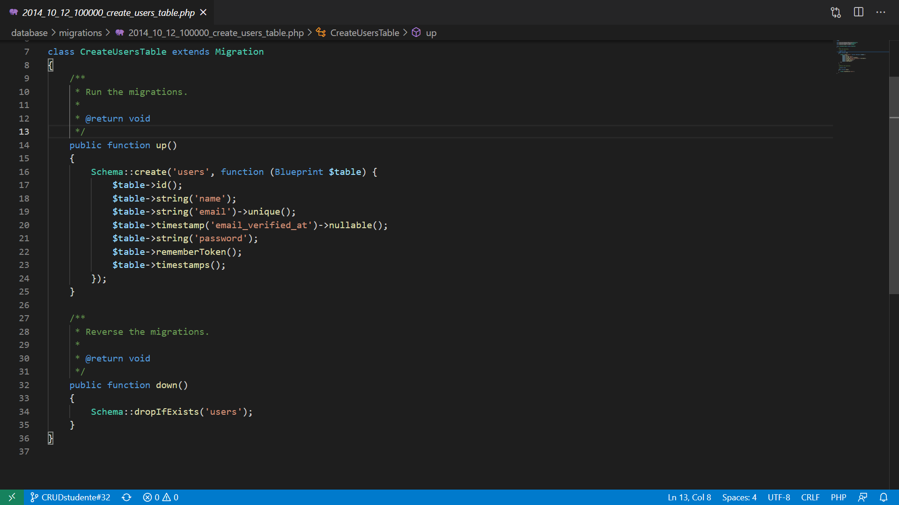

# Migrazioni

## Introduzione

Con _migrazione_ si intende un costrutto particolare di Laravel (e di altri Web Framework similari) necessario per applicare modifiche _strutturali_ al database in maniera sicura.

Dato che la struttura del database non è legata direttamente al codice sorgente di un progetto Laravel, è necessario utilizzare un sistema per garantire che le modifiche strutturali alle tabelle vengano _propagate_ correttamente tra tutti i vari utenti che lavorano sul progetto.

Possiamo considerare le migrazioni, quindi, come un _sistema di versionamento_ del database dell'applicazione.

Usare le migrazioni significa garantire che ogni _contributor_ del progetto abbia la stessa struttura del database senza dover manualmente intervenire per rettificare o correggere eventuali differenze.

Un altro aspetto di fondamentale importanza delle migrazioni è rappresentato dal fatto che ogni migrazioni deve essere eseguita *una sola volta*.  
Una volta eseguita una migrazione senza errori, infatti, il suo risultato viene salvato a database, in modo che, richiamando nuovamente il comando di migrazione, quella stessa azione non venga ripetuta. 


### Creare una migrazione

Per creare una migrazione è necessario utilizzare il seguente comando Artisan sul terminale:

```
php artisan make:migration create_table_names_table
```

**N.B.** Per convenzione il nome delle migrazioni dovrà attenersi ad alcune regole: 
* Tutte le lettere minuscole
* Le parole devono essere separate da _
* Nome della tabella plurale

Laravel è in grado di _indovinare_ le intenzioni dello sviluppatore nel momento in cui si crea una migrazione, utilizzando dei semplici accorgimenti.

Se ad esempio si volesse creare una tabella di nome `users`, il comando 
```bash
php artisan make:migration create_users_table
```
Sarebbe in grado di generare il codice sorgente necessario per, appunto, generare una tabella e alcune colonna (`id`, `created_at`, `updated_at`) in maniera automatica.

Una volta creata la migrazione è possibile trovarla all'interno della cartella *database/migration* insieme a tutte le altre. 

Ogni migrazione ha un *timestamp* (visibile come prefisso del nome del file, nella forma) che permette a Laravel di individuare l'ordine _cronologico_ delle migrazioni.

Una volta aperto il file dovrebbe presentarsi una schermata simile:



All'interno delle migrazioni troveremo due metodi:
* `up()` 

    In questo metodo vengono inserite tutte le azioni (creazione o cancellazione di tabelle, colonne, indici, modifiche di colonne) che verranno eseguite dal comando `migrate`
* `down()` 

    In questo metodo vengono inserite tutte le azioni (creazione o cancellazione di tabelle, colonne, indici, modifiche di colonne) che verranno eseguite dal comando `migrate:rollback`.

    Possiamo pensare al metodo `down()` come ad un _Ctrl-Z_ delle migrazioni, ovvero tutte le azioni necessarie ad _annullare_ gli effetti del corrispondente metodo `up()`.
    

### Principali comandi Artisan sulle Migrazioni

* **php artisan migrate**: 

    Serve ad eseguire tutte le migrazione non ancora effettuate (quindi non ancora presenti a database) nell'ordine definito dai timestamp associati a ciascuna migrazione.
* **php artisan migrate:rollback**:  

    Serve ad _annullare_ le modifiche effettuate dall'ultimo gruppo di migrazioni eseguire, richiamando la funzione `down()` di ciascuna migrazione.
* **php artisan migrate:fresh**: 

    Serve ad inizializzare il database, eseguendo nuovamente le migrazioni, su un database _svuotato_ di ogni tabella
* **php artisan migrate:status**: 
    
    Serve a vedere lo stato delle migrazioni, indicando quelle eseguite (in verde) e quelle da eseguire (in rosso)

### Creare una tabella

All'interno di una migrazione e più precisamente all'interno del metodo `up()` bisognerà andare scrivere il seguente codice:

```php
Schema::create('table_name',function (Blueprint $table) {
    // Definizione colonne tabelle
});
```

Al suo interno dovremo andare a specificare che tipo di colonne vogliamo andare a creare all'interno della tabella, per esempio con:

```php
$table->string('email')->unique()
```

andremo a creare una colonna chiamata *email* che sarà di tipo `VARCHAR(255)`.   
Abbiamo inoltre specificato che all'interno della tabella quel campo dovra essere unico.

Se invece scriviamo:

```php
$table->boolean('corretto')->default(false)
```

avremo una colonna di tipo boolean chiamata *corretto* che di dafault avrà un valore *false*.

### Tipi di Colonne

Le colonne di una tabella possono essere di diverso tipo:

* `$table->string('colonna', 255)` 

    Permette di creare una colonna di tipo `VARCHAR`, impostando il numero massimo di caratteri (in questo caso 255)
    
* `$table->boolean('colonna', default)`

    Permette di creare una colonna di tipo `TINYINT` (su MySQL), corrispondente ad un valore booleano (true/false in PHP).  
    E' possibile impostare un valore booleano predefinto all'interno di `default`.

* `$table->integer('colonna', MAX_DIGITS)->unsigned()` 

    Permette di creare una colonna di tipo `INT` (su MySQL), impostando il numero massimo di cifre (`MAX_DIGITS`).  
    E' possibile inoltre impostare la colonna come `UNSIGNED` (utile per le chiavi di valore).

    Da Laravel 6 in poi, l'ID di ogni tabella in MySQL viene codificato usando un `bigInteger`, invece dell'`integer` normale.  
    E' importante, dunque, nelle _foreign key_ usare il nuovo valore delle colonna come riferimento.
    
* `$table->text('colonna')`

    Permette di creare una colonna di tipo `TEXT` (su MySQL), quindi con una dimensione prefissata, utile per testi lunghi.
    
* date, datetime & timestamp
    TODO
* timestamps & softdeletes
    TODO
