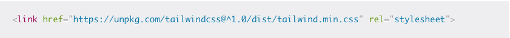

# Il Framework Tailwind CSS

Tailwind è un framework CSS, utilizzato per semplificare la scrittuta di css all'interno di siti web, che si propone come alternativa a soluzioni più tradizionali ed abbondantemente diffuse come Bootstrap o w3.

Si contraddistingue per l’approccio diverso, non più basato su classi che realizzano elementi già preconfenzionati, ma bensì sfruttando una serie di classi di utility per implementare le nostre idee direttamente nelle pagine HTML.

**Vantaggi**

- Permette di scrivere direttamente lo stile all'interno dei tag html, senza mai lasciare il file. 
- Facile da utilizzare da qualunque tipo di utenza, compresi i programmatori alle prime "armi".
- Dotato di una documentazione completa e facilmente accessibile.
- La maggior parte dei progetti Tailwind invia meno di 10 KB di CSS al client, quindi è estremamente leggero.
- Completamente responsive.

**Svantaggi**

- E' più difficile ricordare tutte le classi rispetto ad altri framework(Si può rimediare con un estensione).
- A volte fare l'html è molto lungo e richiede tante righe di codice.

**Trucchetti**

Se il problema è ricordarsi tutti i nomi delle classi l'estensione Tailwind CSS **IntelliSense** per VS Code fa per te.

Ottieni suggerimenti di completamento automatico intelligente, definizioni di classi e altro ancora, tutto all'interno del tuo editor e senza necessità di configurazione.

**Installazione**

Il modo più semplice ma meno personalizzabile è l'inclusione all'interno del proprio progetto del link di import dello stile.

Un altro metodo L’installazione di Tailwind CSS potrebbe risultare un po’ triviale. È possibile scaricarlo come modulo NodeJS sia tramite npm install tailwindcss sia con l’alternativa yarn add tailwindcss.

    npm install -D tailwindcss@npm:@tailwindcss/postcss7-compat @tailwindcss/postcss7-compat postcss@^7 autoprefixer@^9

Tailwind CSS è compilato tramite PostCSS, quindi per utilizzarlo basta creare un file .css per importare le dipendenze appena scaricate.

   

***Utilizzo***

**Personalizzazioni**

La configurazione viene espressa tramite un file Javascript, permettendoci quindi una flessibilità importante.

Il file di configurazione serve per modificare, anche radicalmente, il file CSS generato dal framework e permette di definire il design system utilizzato dal nostro portale, così da avere un set di classi CSS di utility che si adattano perfettamente al nostro layout.

È possibile generare un prototipo di file tramite il comando npx tailwind init. Aggiungendo invece l’opzione --full, il file generato conterrà tutte le opzioni possibili:

    module.exports = {
        important: true,
        theme: { },
        variants: { },
        plugins: { },
        prefix: '',
        separator: '-',
        corePlugins: { }
    }
